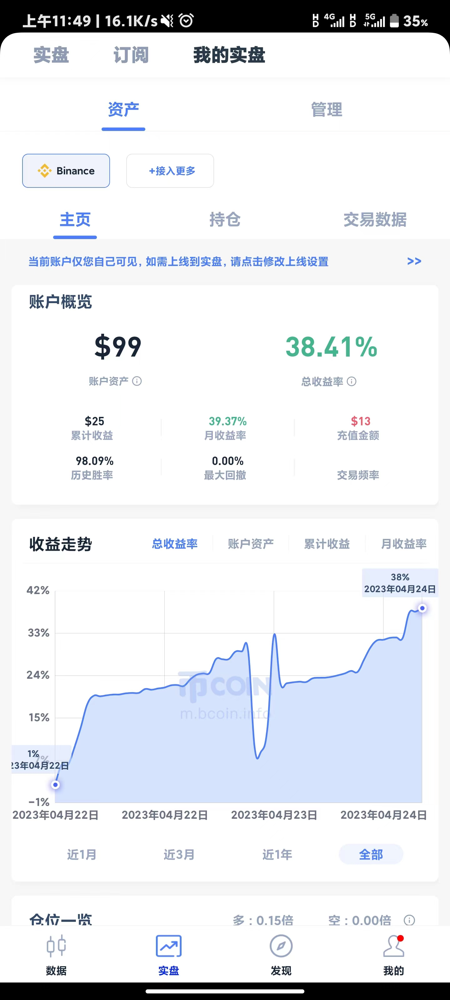
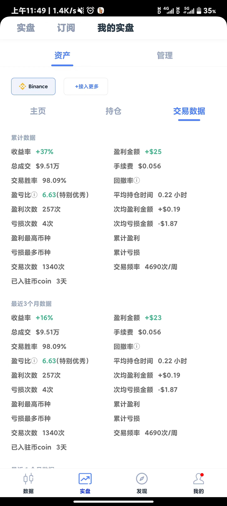

**htf_martin**
2023.10.26 更新
大牛已来，让我们一起为牛市喝彩！

更新一个策略，微博午饭投资的小止盈，宽止损思路。

程序会在下跌的过程中持续加仓，一根K只加一次。

使用前，先用cal_bili脚本将你想执行的K线周期的平均波动测绘下，得到一个标准值。

之后修改martin_long_params中的参数，注释都写的很清楚了。

请把你的持仓模式改为逐仓，杠杆倍数调到10。不要因为过去的失误而不敢梭哈。

然后，启动！**python -u main.py > log.txt**

接下来，让我们一起为梦想窒息，实盘扔了1000块，币coin:foxing 刨去测试花掉的10刀，应该还有125刀，让我们一起见证奇迹！
------------------------<-我是分割线->------------------------
这是一个不是那么高频的高频马丁策略，大概3s轮询一次。

策略的主要思想是如果空仓就开多单，然后在成交均价的下方1-0.002挂当前持仓的两倍买单，在上方1+0.001挂卖单。

除去开仓是市价吃单，其余的都是限价开单，总体来看手续费还可以，但是即使是这样，手续费也要占到利润的1/2了。

所以我推荐你使用BUSD交易对，正如我所说的，BUSD 挂单万1.2，吃单万3，同时你可以转点BNB进去做手续费，只要BNB不产生10%以上的跌幅，你都是赚的。

同时由于这是个马丁策略，在没有爆仓的时候，策略曲线是很好看的，如果波动较大，那么大概有日2%左右的收益。这还是我保守了，实际上日10%我都跑到过，不过你要记住，日10%出现的时候你就离爆仓不远了。实际上在我的回测中，如果出现了1分钟3%的振幅，那大概就是要爆了。

为了保持搞量化的最后的体面，策略会在最后一次加仓后自动设置止损订单，大概是爆仓价格上浮5点，我这里是ETH。

整个框架是仿的backtrader的，但是没仿的那么精细，属于是能用就行，只是方便我把回测的代码尽可能直接复制粘贴过来。

如果你想尝试下这个策略，请把你的持仓模式设置成双向持仓，全仓，杠杆调整到50倍。

然后在broker.py中找到这一栏，把你的apikey secert填上

***self*.future = FutureTrader('apiker','secert')**

然后执行 **python -u main.py > log.txt**

在这里我已经默认你会配置环境,有一个流畅的能访问binance的网络，安装了pandas talib ccxt等库。

最后这个log.txt中是我的历史成交记录，仅供参考。

下图是币coin资金曲线截图，50刀开始跑，还有一点BNB做手续费。

最后的最后，即使你赚钱了也要记得体现，不然最后肯定是爆仓。

欢迎使用我的返佣链接：https://accounts.binance.com/register?ref=151370295
